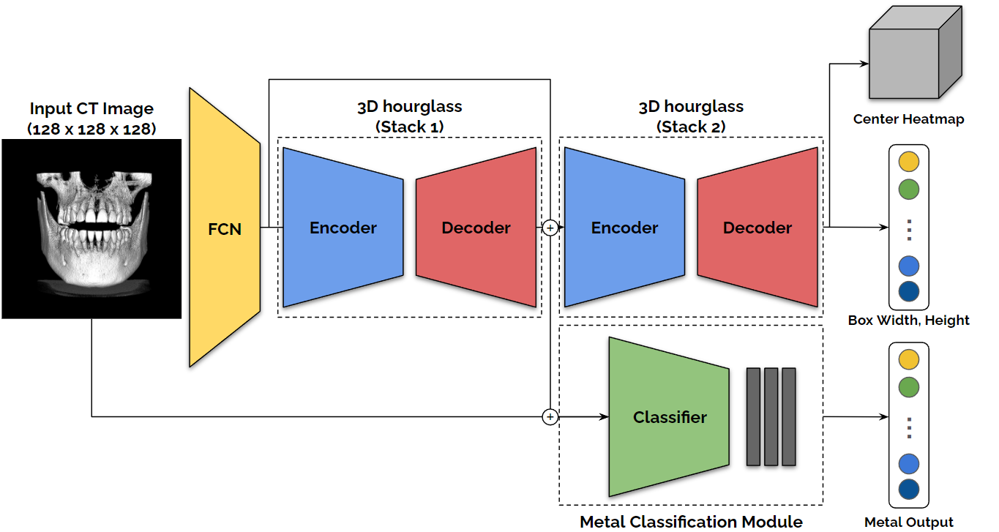

# CBCT-Dental Scan Registration via Metal-Robust CT Segmentation

Implementation of "CBCT-Dental Scan Registration via Metal-Robust CT Segmentation"

## Overall Process


## Framework



## Prerequisites
- [Python 3.6.6](https://www.python.org/)
- [Pytorch 1.9.1](https://pytorch.org/get-started/locally/)


## Installation
The required packages are located in `requirements.txt`.
```
pip install torch==1.9.1+cu111 torchvision==0.10.1+cu111 torchaudio==0.9.1 -f https://download.pytorch.org/whl/torch_stable.html

pip install -r requirements.txt
```


## Dataset
Download the SOC dataset from [google drive](https://drive.google.com/file/d/1hfo33A7diED2dikTpN9o4KnZTxizGdLr/view). Place the files like `datasets/SOC`, so that the following path exists
`dataset/SOC/TrainSet/Imgs/COCO_train2014_000000051941.jpg`.
```
https://drive.google.com/file/d/1hfo33A7diED2dikTpN9o4KnZTxizGdLr/view
```

## Training 
Download our pre-trained weights for initialization from [google drive](https://drive.google.com/file/d/1A2K0YCdHUR_iIbNDYjpE-867Hf6WGbWD/view?usp=share_link). Place the initial weight inside of `pretrained/model_init.pth`.

```
python train.py 
```

## Testing
To evaluate the performance of our method on MAE, S-measure, and E-measure. You can download the weights of the trained model from [google drive](https://drive.google.com/file/d/12yD04QZmYq7TPB3MWHHsktWpQHEFbvyP/view?usp=share_link).
Place the trained weight inside of `saved_models/model_final.pth`.

```
python test.py
```

To evaluate the performance of our method on $Sal$ which we proposed. It might takes 3-4 minutes to extract the backtracked boxes.

```
python sal_test.py
```